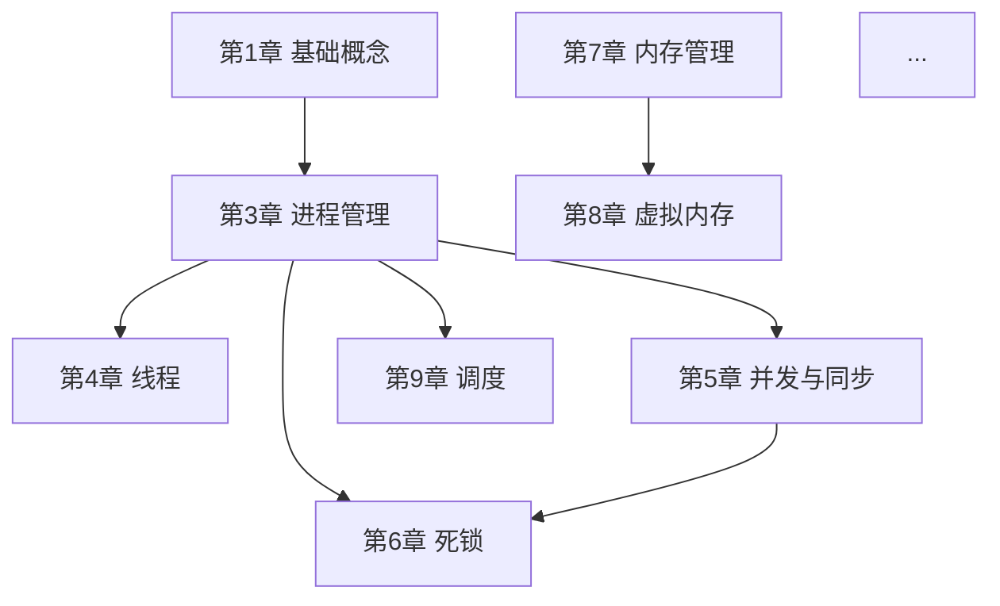
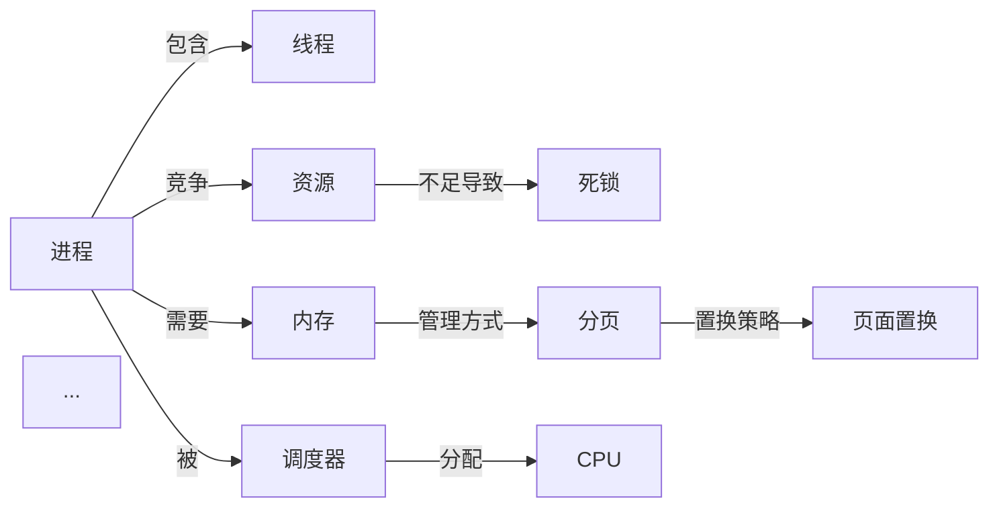

# 知识库模板参考

此文件为「期末粥」(`final-exam-porridge`) Skill 生成知识库和 PDF 时的格式参考标准。

---

## 核心原则：题型跟老师走

- **老师给了考试题型分布** → 题型训练和模拟卷严格按老师给的来，不擅自添加未出现的题型
- **老师没给题型分布** → 默认全题型覆盖（选择、填空、简答、计算、综合）

---

## 知识库目录结构

```
[科目名称]备考知识库/
├── 00_学习方案.md                # 个性化学习计划（含每日简答背诵计划）
├── 01_考试重点总览.md            # 所有知识点汇总速览 + 分值预估 + 考试题型分布
├── 02_知识体系图谱.md            # 脑图 + 章节关系 + 核心概念关系图 + 学习路线
├── 03_知识点详解/                # 按章节组织的详细体系化讲解
│   ├── 第一章_XXX.md
│   ├── 第二章_XXX.md
│   └── ...
├── 04_题型训练/                  # 【只生成考试实际考的题型】
│   ├── 选择题训练.md             # 考试有选择题 → 生成（>=20道，每题带解析）
│   ├── 填空题训练.md             # 考试有填空题 → 生成（>=15道，每题带解析）
│   ├── 简答题背诵版.md           # 考试有简答题 → 生成（全面覆盖，可直接背诵）
│   ├── 计算题训练.md             # 考试有计算题 → 生成（每种类型3题）
│   └── 综合题训练.md             # 考试有综合题 → 生成（每种类型3题）
├── 05_模拟试卷.md                # 【题型/题量/分值严格匹配真实考试】
├── 06_速成视频合集.md            # B站视频汇总
└── 07_核心公式速查.md            # 考前快速回顾用
```

---

## 知识体系图谱模板（02_知识体系图谱.md）

```markdown
# [科目]知识体系图谱

## 一、整体知识脑图

[科目名称]
├── 模块一：[基础概念]（第X-X章）
│   ├── 知识点A — 前置：无
│   │   ├── 子知识点A1
│   │   └── 子知识点A2
│   └── 知识点B — 前置：知识点A
│       └── 子知识点B1
├── 模块二：[核心机制]（第X-X章）
│   ├── 知识点C — 前置：知识点A, B
│   │   ├── 子知识点C1
│   │   └── 子知识点C2
│   └── 知识点D — 前置：知识点C
└── 模块三：[高级应用]（第X-X章）
    ├── 知识点E — 前置：知识点C, D
    └── 知识点F — 前置：知识点E

## 二、章节依赖关系



## 三、核心概念关系图



## 四、推荐学习路线

1. **先学基础**：[第1-2章] 建立基本概念
2. **再学核心**：[第3-6章] 进程/线程/同步/死锁（最核心，分值最高）
3. **然后内存**：[第7-8章] 内存管理机制
4. **最后外围**：[第9-12章] 调度/IO/文件系统
5. **综合练习**：跨章节综合题专项训练
```

---

## 知识点讲解模板（03_知识点详解/）

每个知识点的 Markdown 必须包含以下板块，且要深入详细：

```markdown
## [知识点名称] 【老师重点★】（如适用）★★★

### 前置知识
- [列出理解本知识点前必须掌握的 1-3 个概念]

### 一、是什么（定义）
最通俗的语言解释，如同讲给从未接触过的人听。
用1个具体的生活类比或场景帮助理解。

### 二、为什么重要
- 考试分值占比：约X分
- 在科目体系中的位置：属于XX模块的核心/基础/应用
- 实际意义：[一句话说明]

### 三、详细讲解
#### 3.1 核心原理
[为什么这样设计？解决了什么问题？]

#### 3.2 关键机制/公式
[逐步推导，不跳步]
- 公式：...
- 每个参数的含义：...
- 举例说明：...

#### 3.3 图示说明
[用 Mermaid 流程图/状态图/时序图 展示]

#### 3.4 完整示例
[至少1个完整的、有步骤的示例]

### 四、知识体系关联 [体系]
- 所属模块：[模块名称]
- 前置知识：[X.X 知识点] → 本知识点
- 后续知识：本知识点 → [X.X 知识点]
- 横向对比：[与XXX的区别] | [与XXX的联系]
- 一句话定位：在 [科目] 体系中，本知识点是连接 [A] 和 [B] 的桥梁

### 五、通俗记忆法
- 记忆口诀：[朗朗上口的口诀]
- 类比理解：[生活中的类比]
- 关键词联想：[帮助记忆的技巧]

### 六、考试题型 & 出题角度
- 选择题可能考察：[角度1]、[角度2]、[角度3]
- 填空题可能考察：[角度1]、[角度2]
- 简答题可能考察：[角度1]、[角度2]、[角度3]
- 计算题可能考察：[角度1]、[角度2]（如适用）
- 综合题可能考察：[角度1]、[角度2]（如适用）

### 七、易错点提示
【!!注意!!】 误区1：[描述] — 正确理解是：[正确]
【!!注意!!】 误区2：[描述] — 正确理解是：[正确]
```

**篇幅标准：**
- ★★★：>=800字，>=2个示例，>=4种出题角度
- ★★：>=500字，>=1个示例，>=2种出题角度
- ★：>=300字，>=1个示例

---

## 简答题背诵版模板（04_题型训练/简答题背诵版.md）

```markdown
# [科目]简答题背诵版

> 使用说明：以下简答题覆盖全部章节，答案精炼可直接背诵。
> 每条答案标注【背诵关键词】，考前重点记忆关键词即可还原完整答案。

---

## 第X章：[章节名]

### Q1：[问题1] 【背诵关键词：关键词A, 关键词B, 关键词C】

**标准答案：**

1. **第一条要点：** [精炼表述，不超过两行]
2. **第二条要点：** [精炼表述，不超过两行]
3. **第三条要点：** [精炼表述，不超过两行]
...
N. **第N条要点：** [精炼表述]

---

### Q2：[问题2] 【背诵关键词：...】

**标准答案：**

1. ...
```

---

## 计算题训练模板（04_题型训练/计算题训练.md）

```markdown
# [科目]计算题训练

## 类型一：[计算类型名称]

### [理解型] 题1：[题目描述]

**解题过程：**
- 步骤1：[具体做了什么] — **为什么这样做：** [理由]
- 步骤2：[具体做了什么] — **为什么这样做：** [理由]
- 步骤3：...
- 最终计算：[写出计算式，代入数值，得出结果]

**答案：** [最终结果]

**关键技巧：** [1-2句总结这类题的解题要点]

---

### [巩固型] 题2：[题目描述（与题1类型相同，换数据或场景）]

**解题过程：** [完整过程，可稍简于题1]

**答案：** [结果]

---

### [自练型] 题3：[题目描述]

> **答案：** [只给答案，不给过程]

---

## 类型二：[另一个计算类型名称]
...（同上结构，每种类型3题）
```

---

## 综合题训练模板（04_题型训练/综合题训练.md）

```markdown
# [科目]综合题训练

## 专题一：[综合题型名称]

### [理解型] 题1：[题目描述]

**解题思路：**
[先整体分析题目，说明解题方向，再动手做。至少3句话。]

**解题过程：**
- 步骤1：[做什么 + 为什么]
- 步骤2：[做什么 + 为什么]
- ...

**答案：** [最终结果]

**考点总结：**
- 这道题考察了：[列出考察的知识点]
- 适用场景：[什么情况下用这种方法]
- 易错环节：[哪里容易出错]

---

### [巩固型] 题2：[题目描述（同题型，换数据/场景）]

**解题过程：** [完整过程]
**答案：** [结果]

---

### [自练型] 题3：[题目描述]

> **答案：** [只给答案]

---

## 专题二：[另一个综合题型名称]
...（同上结构，每种题型3题）
```

---

## 模拟试卷模板（05_模拟试卷.md）

```markdown
# [科目]模拟试卷

**考试时间：** [XX]分钟  |  **满分：** [XX]分

---

## 一、选择题（每题X分，共X分。在每题给出的四个选项中，只有一项符合题目要求）

**1.** [题目]
A. [选项A]  B. [选项B]  C. [选项C]  D. [选项D]
> [考：第X章-知识点名]

**2.** [题目]
...

---

## 二、填空题（每空X分，共X分）

**1.** [填空题目，留空用 ______ ]
> [考：第X章-知识点名]

---

## 三、简答题（每题X分，共X分）

**1.** [简答题目]
> [考：第X章-知识点名]

---

## 四、计算题（每题X分，共X分）

**1.** [计算题目]
> [考：第X章-知识点名]

---

## 五、综合题（每题X分，共X分）

**1.** [综合题目]
> [考：第X章-知识点名1, 知识点名2]

---

# 参考答案与评分标准

## 一、选择题
| 题号 | 1 | 2 | 3 | ... |
|------|---|---|---|-----|
| 答案 |   |   |   |     |

## 二、填空题
**1.** [答案]（每空X分，共X分）

## 三、简答题 
**1.** [参考答案]
**采分点：** （1）[要点1]（X分） （2）[要点2]（X分）...

## 四、计算题
**1.** [解题过程 + 答案]
**采分点：** 步骤1（X分）→ 步骤2（X分）→ 最终结果（X分）

## 五、综合题
**1.** [解题过程 + 答案]
**采分点：** ...
```

---

## 重点标注规范

| 标记 | 含义 | 使用场景 |
|------|------|---------|
| ★★★ 必考 | 老师画重点 + 高频考点 | 必须完全掌握，花最多时间 |
| ★★ 重要 | 课程核心内容 | 理解透彻，会做对应题型 |
| ★ 了解 | 可能涉及 | 知道概念即可 |
| 【老师重点★】 | 老师课堂上特别强调 | 最高优先级，优先学习背诵 |

---

## 颜色约定（PDF 生成用）

- 深蓝 `#1a5276` — 一级标题
- 中蓝 `#2980b9` — 二级标题
- 红色 `#e74c3c` — 重点标注 / ★★★
- 橙色 `#f39c12` — 次重点 / ★★
- 绿色 `#27ae60` — 了解级别 / ★
- 灰色 `#7f8c8d` — 辅助说明文字

---

## B 站视频搜索关键词模板

```
site:bilibili.com "[科目]" "[知识点]" 速成 考前
bilibili [科目] 期末速成 [知识点]
[科目] 考前冲刺 速成课
```

筛选标准：
- 播放量 > 5000
- 时长 5-30 分钟
- 标题含"速成/考前/期末/冲刺"
- 排除标题含"广告/推广"的视频

---

## 学习方案模板（00_学习方案.md）

```markdown
## [▼日程] [科目]考前学习方案（共 X 天）

### 整体策略
- 考试时间: YYYY-MM-DD
- 剩余天数: X 天
- 知识点总数: N个（★★★ X个 / ★★ Y个 / ★ Z个）
- 每日建议学习时长: 2-3 小时
- 策略：[根据剩余时间定制策略]

### 知识学习路线
1. 先学 [基础模块] → 2. 再学 [核心模块] → 3. 最后 [应用模块]

### 三阶段计划
| 阶段 | 天数 | 任务 | 重点 |
|------|------|------|------|
| 知识学习 | Day 1-X | 通读知识点详解 + B站视频 | 理解每个概念 |
| 题型突破 | Day X+1-Y | 按题型刷训练题 | 掌握解题方法 |
| 模拟冲刺 | Day Y+1-考前 | 做模拟卷 + 查漏补缺 | 检验水平 |

### 每日计划
| 日期 | 学习内容 | 重点掌握 | 练习任务 | 简答背诵 | 预计时长 |
|------|---------|---------|---------|---------|---------|
| Day 1 | 第1-2章 | [知识点] | 选择题10道 | 3道 | 2h |
...

### 【老师重点★】清单（必背）
| # | 知识点 | 章节 | 分值预估 | 优先级 |
|---|--------|------|---------|-------|
| 1 | [知识点] | 第X章 | 约X分 | 最高 |
...

### 简答题每日背诵计划
| 日期 | 背诵范围 | 数量 | 累计 |
|------|---------|------|------|
| Day 1 | 第1-2章简答题 | X道 | X道 |
...

### 最后冲刺（考前1天）
- [ ] 速览01_考试重点总览（30min）
- [ ] 背诵04_简答题背诵版全部（1h）
- [ ] 速览07_核心公式速查（15min）
- [ ] 完整做一套05_模拟试卷（按考试时间模拟）
- [ ] 标记错题，针对性复习薄弱点
- [ ] 早睡，保证充足睡眠
```

---

## 核心公式速查模板（07_核心公式速查.md）

```markdown
# [科目]核心公式速查

> 考前15分钟快速回顾，每章关键公式一页打尽。

## 第X章：[章节名]

| 公式 | 含义 | 参数说明 | 使用场景 |
|------|------|---------|---------|
| F = m*a | 牛顿第二定律 | F=力, m=质量, a=加速度 | 力学计算 |

## 第Y章：[章节名]
...
```
